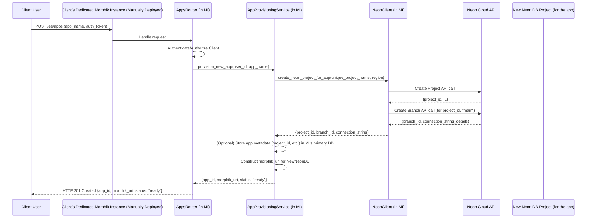
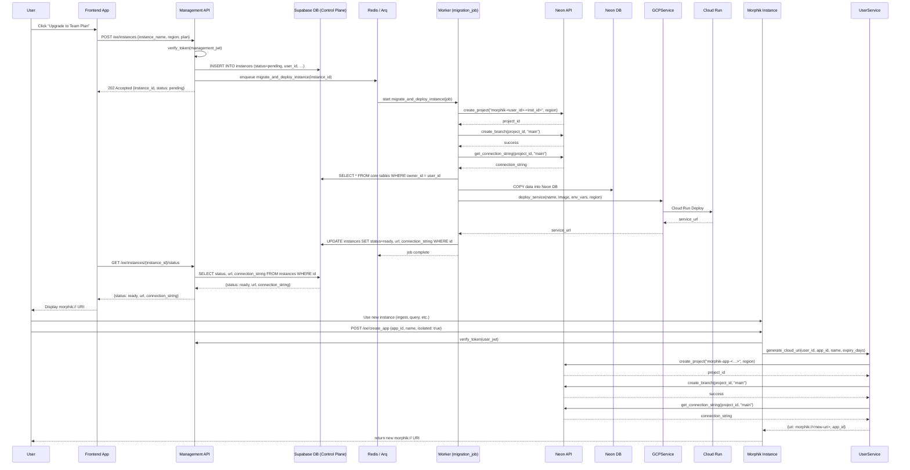

Below is an end-to-end proposal that includes spinning up a dedicated Morphik server on GCP, migrating that user’s data from Supabase → Neon, and then handing them back a fully running instance. Once that “instance” is live, they can call our existing “create_app (isolated=true)” endpoint (in `ee/routers/cloud_uri.py`) to spin up additional databases/URIs inside their own server.

---

## 1. New, full-instance workflow

1. **User upgrades → receives “management” JWT**
   • This token contains at least:
     - `user_id`
     - `is_verified_team_admin: bool`
     - `is_payment_updated: bool`

2. **Client kicks off instance creation**
   POST /ee/instances
   Authorization: Bearer <management_jwt>
   Body:
   ```json
   {
     "instance_name": "acme-team",
     "region":        "us-west1",
     "plan":          "team-tier"
   }
   ```
   Handler:
   - Verify `(is_verified_team_admin && is_payment_updated)`.
   - Insert a row in our control-plane table `instances` with status=`pending`.
   - Enqueue an Arq background job (e.g. `migrate_and_deploy_instance`) passing the new `instance_id`.

3. **Background job: migrate_and_deploy_instance**
   a. **Provision Neon database**
      - Call Neon API → create project `morphik-<user_id>-<instance_id>` in the requested region.
      - Create primary branch “main”
      - Fetch connection string (`postgres://…`)
   b. **Clone/Migrate data**
      - Programmatically clone our Morphik GitHub repo (or bind‐mount our migration scripts).
      - Connect to Supabase/Postgres (our free-tier DB) and to the new Neon DB.
      - For each core table (documents, chunks, embeddings, folders, graphs, user-limits, etc.), COPY only the rows where `owner.user_id == <user_id>`.
   c. **Deploy a per-user Morphik server on GCP**
      - Use a long-lived Docker image of Morphik from our Container Registry.
      - Invoke GCP Cloud Run (or Cloud Run V2) API to deploy a new service named e.g. `morphik‐<user_id>-<instance_id>`.
      - Pass in these env vars:
        • `POSTGRES_URI=<new Neon connection string>`
        • `JWT_SECRET_KEY`, `JWT_ALGORITHM`, etc.
      - Allow unauthenticated (or restrict to our client IPs).
      - Grab the resulting HTTPS URL (e.g. `https://morphik‐1234.uc.a.run.app`).
   d. **Mark instance ready**
      - Update `instances` row → `status=“ready”`, record `url` and `connection_string`.
      - If any step fails, mark `status=“failed”` + capture error.

4. **Client polls for readiness**
   GET /ee/instances/{instance_id}/status
   → `{ status: "pending"|"ready"|"failed", url?: "...", error?: "…" }`

5. **Use the new instance**
   - Once `status=="ready"`, the client now has their own Morphik server URL.
   - **All subsequent Multi-Tenant API traffic** (e.g. `/ingest`, `/query`, etc.) should be directed to that URL+token pair.
   - Internally, our `api.py`’s DB dependency can remain pointed at the Neon DB for that instance.

6. **Spin up further “apps”**
   - Within that server they can call the existing EE endpoint (`POST /ee/create_app`) with `"isolated": true`.
   - That simply provisions a new Neon DB (project) under the same Neon account, returning a morphik:// URI for that new “app.”

7. **Tear down**
   DELETE /ee/instances/{instance_id}
   → triggers:
     • delete Neon project
     • delete Cloud Run service
     • delete `instances` row.

---

## 2. New components

1. **Control-plane table** (`instances`) in our Supabase database:
   Stores `instance_id, user_id, project_id, branch, url, connection_string, plan, region, status, created_at, updated_at`.

2. **NeonClient** (`core/services/neon_client.py`):
   Async thin wrapper around Neon’s HTTP API for project/branch creation and creds.

3. **GCPService** (`core/services/gcp_service.py`):
   - `deploy_service(name, image, env_vars, region) → url`
   - `delete_service(name, region)`

4. **InstanceService** (`core/services/instance_service.py`):
   - `create_instance(user_id, instance_name, region, plan) → instance_id`
     • Inserts `instances` row, enqueues `migrate_and_deploy_instance` job
   - `get_status(instance_id)`, `list_instances(user_id)`, `delete_instance(instance_id)`

5. **Arq job handler** (`ee/jobs/migration_job.py`):
   Orchestrates the 3-step migration + deployment flow and updates status.

6. **New EE router** (`ee/routers/instances.py`):
   - POST `/ee/instances` → kick off
   - GET `/ee/instances/{id}/status` → status
   - GET `/ee/instances` → list
   - DELETE `/ee/instances/{id}` → teardown

---

## 3. Clarifying questions

1. **Container strategy**
   - Do we already publish a Morphik Docker image to GCR/GAR?
   - If not, should we instead clone & build the repo per-instance (via Cloud Build)?

2. **Data-migration details**
   - Exactly which tables & columns must be copied?
   - Do we need a zero-downtime cutover, or can instances start “empty” and then be back-filled via the job?

3. **Access patterns**
   - Once /status returns ready, do you want us to return a full morphik:// URI (with embedded JWT) so the client can start using it immediately?

4. **Instance naming / domain**
   - Would you prefer user-specific subdomains (e.g. `acme.morphik.app`) or Cloud Run default URLs?

5. **Scalability / quotas**
   - Do you want to limit how many instances a team can spin up?
   - How should we surface that in the API?

Once we agree on these, I can begin drafting out the service classes, Arq job, the new router file, and the DB schema/migration. Let me know your thoughts!





